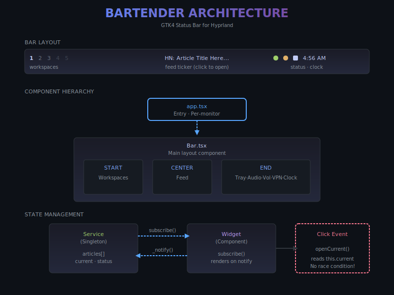

# Bartender

A GTK4 status bar for Hyprland that replaces waybar + mako with proper state management, true transparency, and integrated notifications.

Built with [AGS](https://github.com/Aylur/ags) (Aylur's GTK Shell).

## Quickstart (Arch Linux)

```bash
paru -S bartender-git                              # Install from AUR
mkdir -p ~/.config/bartender && chmod 700 $_       # Create config dir
systemctl --user enable --now bartender.service    # Start (stops waybar/mako)
```

> [!NOTE]
> Bartender's systemd service uses `Conflicts=waybar.service mako.service` for graceful replacement. Both can remain installed; only one runs at a time.

## Features

| | Feature | Description |
|---|---------|-------------|
|  | **Workspace Indicators** | 1-5 with visual states: focused, occupied, empty |
|  | **Feed Ticker** | FreshRSS integration with atomic click handling |
|  | **VPN Status** | Mullvad with rotation toggle (US/CA) |
|  | **ProxyForge** | Debug proxy control (mitmdump) |
|  | **Audio Toggle** | Speakers/headphones/both via ALSA |
|  | **System Tray** | With intelligent icon filtering |

Plus: transparent background, volume slider, clock with calendar popup, WiFi, Bluetooth, weather, and integrated notifications.



## Installation

### From AUR (Recommended)

```bash
# Using paru
paru -S bartender-git

# Or using yay
yay -S bartender-git
```

After installation, set up your configuration:

```bash
# Enable and start the service (creates default config automatically)
systemctl --user enable --now bartender.service

# Edit config to add your RSS feed URL
nano ~/.config/bartender/config.toml
```

The bartender service will automatically stop waybar and mako when started. See [MIGRATION.md](MIGRATION.md) for detailed migration instructions.

### Development

**Native Arch Linux (recommended for development)**:
```bash
git clone https://github.com/johnzfitch/bartender.git
cd bartender
make install-deps  # One-time: installs pacman/AUR dependencies
make dev           # Build and run
```

**Using Nix**:
```bash
git clone https://github.com/johnzfitch/bartender.git
cd bartender
nix develop --command ags run .
```

### Kill / Restart

```bash
# If using systemd
systemctl --user restart bartender.service

# Manual kill
pkill -9 gjs
# or
ags quit -i bartender
```

### Uninstallation

```bash
# Stop and disable the service
systemctl --user disable --now bartender.service

# Remove the package
paru -R bartender-git

# Optionally remove config (your credentials)
rm -rf ~/.config/bartender

# Restart waybar/mako if desired
systemctl --user start waybar.service mako.service
```

## File Structure

```
bartender/
├── flake.nix                 # Nix build configuration
│
├── app.tsx                   # Entry point - creates bars per monitor
│                             # Sets up instanceName, requestHandler
│
├── Bar.tsx                   # Main bar layout
│   ├── WorkspaceButton()     # Individual workspace with state
│   ├── Workspaces()          # Container for 1-5 buttons
│   ├── Tray()                # System tray with icon filtering
│   ├── Volume()              # WirePlumber volume control
│   └── Clock()               # Time + calendar popup
│
├── services/                 # Singleton state managers
│   ├── feed.ts               # FreshRSS API, weighted random selection
│   │                         # 5-min refresh, 8-sec cycle, pause on hover
│   │
│   ├── vpn.ts                # Mullvad status + rotation daemon
│   │                         # 20-sec interval between US/CA servers
│   │
│   └── proxyforge.ts         # mitmdump process control
│                             # Start/stop proxy, open viewer
│
├── widgets/                  # UI components using services
│   ├── Feed.tsx              # Displays feed.current, click → openCurrent()
│   ├── Vpn.tsx               # VPN icon + rotation toggle
│   ├── ProxyForge.tsx        # Proxy status + controls
│   └── Audio.tsx             # ALSA toggle (amixer card 3)
│
├── styles/
│   └── style.scss            # GTK4 CSS with SCSS preprocessing
│                             # Uses gtkalpha() for transparency
│
└── README.md                 # This file
```

## Configuration

Bartender uses a single `config.toml` file for all settings. A default config is created automatically on first run.

### Quick Setup

```bash
# Config is auto-created at ~/.config/bartender/config.toml
# Edit it to add your RSS feed URL:
nano ~/.config/bartender/config.toml
```

### Configuration Options

```toml
[layout]
left = ["workspaces", "weather"]
center = ["feed"]
right = ["tray", "bluetooth", "wifi", "audiomixer", "sysmon", "vpn", "clock"]

[feed]
# Any RSS/Atom feed URL
url = "https://example.com/rss.xml"
# Optional auth header for authenticated feeds (e.g., FreshRSS)
auth_token = "GoogleLogin auth=YOUR_TOKEN"

[audio]
card = 3  # ALSA card number (find with: aplay -l)

[comfyui]
dir = "~/ComfyUI"  # Supports ~/ for home directory
port = 8188

[proxyforge]
targets = "claude,codex,node"  # Processes for eBPF interception

[notifications]
monitor = "primary"  # "primary", "focused", or monitor number
groupByApp = true

[clock]
format = "%a %b %d %l:%M %p"

[weather]
location = "auto"
units = "imperial"  # or "metric"

# Widget visibility (all default to true)
[widgets]
workspaces = true
feed = true
# ... etc
```

See `config.toml.example` for a complete example with comments.

### Migration from .env

If you have an existing `config.json`, it will be automatically migrated to `config.toml` on first run. The old file is backed up to `config.json.bak`.

For `.env` variables, move them to the appropriate TOML sections:
- `FRESHRSS_API_URL` → `[feed] url`
- `FRESHRSS_AUTH_TOKEN` → `[feed] auth_token` (prefix with `GoogleLogin auth=`)
- `AUDIO_CARD` → `[audio] card`
- `COMFYUI_*` → `[comfyui]` section
- `PROXYFORGE_TARGETS` → `[proxyforge] targets`

> [!NOTE]
> Config changes are hot-reloaded within 100ms. No restart required.

## Styling

GTK4 CSS is NOT regular CSS. Key differences:

### Transparency

```scss
// SCSS wrapper for GTK alpha function
@function gtkalpha($c, $a) {
  @return string.unquote("alpha(#{$c},#{$a})");
}

window.bartender {
  background: transparent;  // Window itself is transparent

  > box {
    background: gtkalpha(#1a1b26, 0.85);  // Inner box has alpha
  }
}
```

### Stripping Button Chrome

```scss
button {
  all: unset;  // Remove ALL default GTK styling
  padding: 8px;
  // Set colors per-widget, not globally
}
```

### Workspace States

```scss
.workspaces .ws {
  color: rgba($foreground, 0.2);  // Empty (default)

  &.occupied { color: rgba($foreground, 0.7); }
  &.focused { color: $foreground; font-weight: bold; }
}
```

## Security Considerations

- **Config File Security**: `config.toml` may contain auth tokens. Protect with `chmod 600 ~/.config/bartender/config.toml`
- **URL Validation**: All URLs from external feeds are validated to only allow `http://` and `https://` schemes, preventing execution of dangerous schemes like `javascript:` or `file://`
- **No Hardcoded Credentials**: Authentication tokens are stored in config files, not hardcoded in source
- **Path Configuration**: System paths are configurable to avoid hardcoded assumptions about system layout

## Dependencies

Managed via `flake.nix` or `install-deps.sh`:

**Pacman:**
- gjs, gtk4, gtk4-layer-shell, libsoup3, libadwaita
- alsa-utils (for amixer in Audio widget)
- curl (for feed fetching)
- dart-sass

**AUR:**
- AGS with Astal packages: libastal-{io,4,hyprland,tray,wireplumber,network,bluetooth,notifd}-git
- aylurs-gtk-shell

## Troubleshooting

### "instance has no request handler"
AGS is already running. Kill with `pkill -9 gjs`

### Workspace states not updating
Ensure signals are connected:
```tsx
hyprland.connect("notify::focused-workspace", update)
hyprland.connect("notify::workspaces", update)
```

### No transparency
- Window needs `background: transparent`
- Use `gtkalpha()` for inner elements (not `rgba()`)
- Check compositor supports transparency

### Feed not loading
- Verify `[feed] url` is set in `~/.config/bartender/config.toml`
- Check `curl` is available: `which curl`
- Test the feed manually: `curl -s "YOUR_FEED_URL"`
- For authenticated feeds, test with: `curl -H "Authorization: YOUR_AUTH_TOKEN" "YOUR_FEED_URL"`

### GTK4 crash on startup
Some icon themes cause infinite recursion in GTK4. Set a safe theme:
```bash
export GTK_ICON_THEME=Adwaita
```
The systemd service and wrapper script set this automatically.

### Service starts but no bar visible
1. Check Hyprland is running
2. Verify GTK4 layer shell: `pacman -Q gtk4-layer-shell`
3. Check for errors: `journalctl --user -u bartender.service -f`

## Migration from Waybar/Mako

See **[MIGRATION.md](MIGRATION.md)** for:
- Feature comparison table
- Step-by-step migration procedure
- Configuration migration guide
- Rollback instructions

**Quick rollback:**
```bash
systemctl --user stop bartender.service
systemctl --user start waybar.service mako.service
```

## License

MIT
